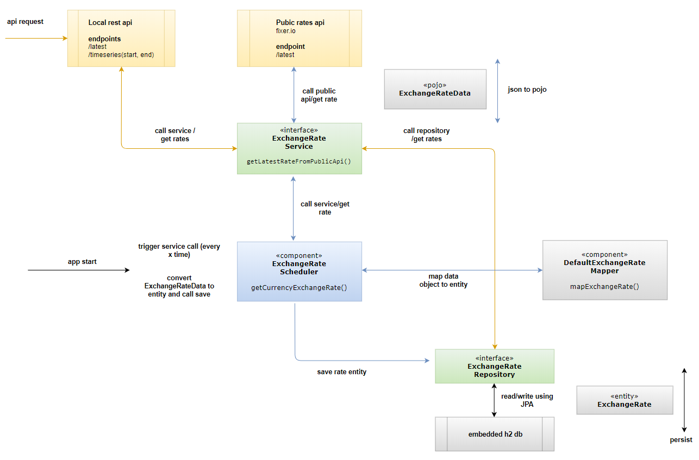

# currency-exchange
## Demo rest service for currency exchange rates betwen EUR/USD

### Features

Service created as spring boot project that gets exchange rates periodically from public api (https://fixer.io/quickstart) and stores them in local db. Interval in which rates are collected can be set in config.properties located inside resources folder.
 - e.g: exchangerate.interval=60000

Service then exposes two rest endpoints for exchange rates:
- /latest - returns latest exchange rate for EUR/USD
- /timeseries - returns rates found between two dates

##### Example usage:

```
$ http://localhost:8090/latest
$ http://localhost:8090/timeseries?startDate=2018-04-15&endDate=2018-04-16
```

### Installation

Prerequisites:

- [Git](https://git-scm.com/)
- [Maven](https://maven.apache.org/download.cgi)

##### Clone and start the app:

```
$ git clone https://github.com/slozic/currency-exchange.git
$ cd currency-exchange.git
$ mvn spring-boot:run
```

#### Unit Tests
Can be run from command line:

```
$ mvn test
```
Mock mvc and service tests:
- class DefaultExchangeRateControllerTest
  - getLatestRate()
  - getRatesBetweenDates()

Data access tests:
- class ExchangeRateRepositoryTest
  - findFirstByOrderByTimestampDesc()
  - findAllByDateBetween
  
Public api test:
- class DefaultExchangeRateServiceTest
  - getLatestRateFromPublicApi()


### Solution diagram



